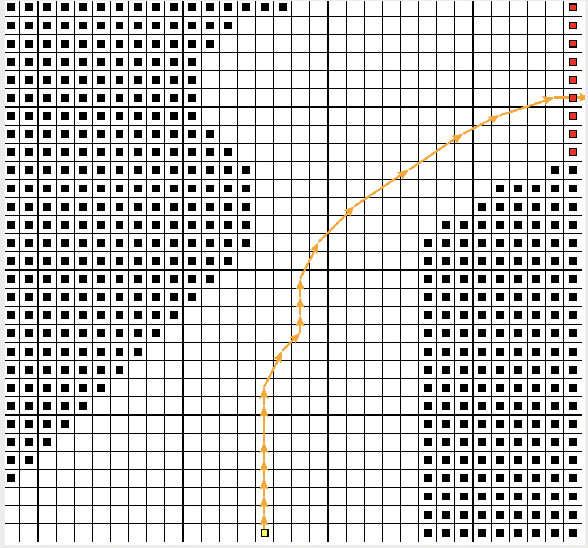
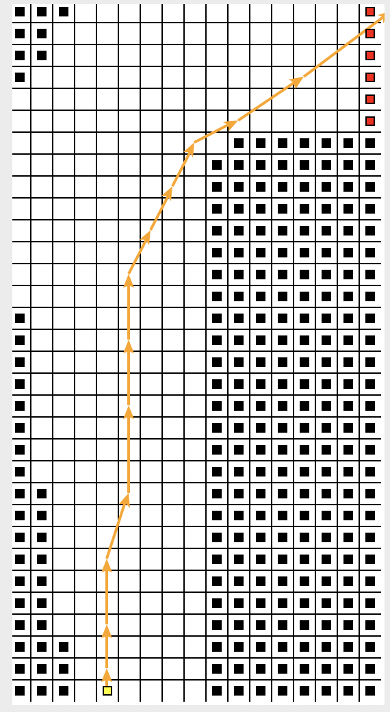

# RaceCar Sutton

使用Sarsa($\lambda$)和REINFORCE算法解决Race Car问题(Reinforcement Learning an Introduction Sutton Ex 5.12)

## 安装环境
```
pip install -r requirements.txt
```

## 可视化
使用方法：

1. 逐步运行Jupyter Notebook Reinforce-policy.ipynb 或者 Sarsa-lambda.ipynb
2. 等待强化学习完毕，详细运行过程可以看Jupyter Notebook界面
3. 弹出交互界面
4. 点击底部白色区域
5. 继续进行实验
 <center class="half">
         
 </center>


## 评估
前两步可以省略，我已经将运行结果保存在result文件夹之中
1. 逐步运行Jupyter Notebook evaluate_reinforce.ipynb 或者 evaluate_sarsa.ipynb
2. 可以修改赛道 race1, race2，获取不同的效果文件
3. 通过运行 compare.ipynb 进行可视化比较